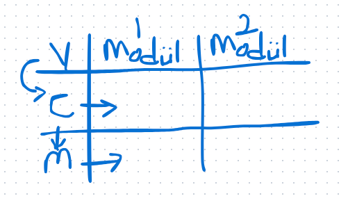

# Sistem Mimarisinin Yazılım Üzerine Etkisi

## Yüksek Erişilebilirlik
Yüksek erişilebilirlik isteniyorsa, çökmelere karşı önlem alınabilmesi için aynı servisten bir tane daha ekler ve load balancer kullanırız. Load balancer'ın da iki tane olması gerekmektedir.

Uygulama çoğaltılabilir, ancak veritabanını çoğaltmak sıkıntılıdır. Veritabanı dikey olarak büyümek zorundadır. Bu sebeple, aktif-pasif bir veritabanı yapılabilir. Bu durumda, iki veritabanının her ikisi de aktif olarak çalışabilmeli ve pasif olanı ihtiyaç anında kullanılmaya hazır olmalıdır.

Eğer otomatik bir çözüm isteniyorsa, Patroni gibi bir sistem kullanılabilir. Ancak bunun maliyeti bulunmaktadır ve sistemin çoğaltılması gerekir. Çünkü bu sistemin de çökme ihtimali göz önünde bulundurulmalıdır. Alternatif olarak, manuel bir çözüm de yapılabilir. Ancak zaman faktörünü göz önünde bulundurmak önemlidir.

## Distributed Cache Kullanımı
Veri aktarımının Apple cihazları arasında olabilmesi gerekir, bu da uygulama önbelleği gibi çalışır. Örneğin, Redis kullanılabilir. Bu sistemin de en az iki örneği olmalıdır.

Eğer uygulamanın böyle bir özelliği yoksa, pansuman teknikleri kullanılabilir. Stick session gibi çözümlerle bunu yapmak mümkündür, ancak önerilmez çünkü yük dengesizliği yaşanabilir. Geliştiricinin bu durumu tasarlaması ve dökümantasyonu yapması gerekmektedir.

Cache, gerekli bilgiyi kullanımda tutmak için kullanılır. Memory Grid, veritabanına bağlanarak bilgiyi depolar.

Veritabanındaki kayıp sınırı, bir sistem çökerse diğerine geçiş sırasında sorun yaşanmasını engellemek için +1, +2 gibi güvence eklemeleri yapılabilir. Bu eklemeler maliyete bağlıdır. Ayrıca, bu sistemleri fiziksel olarak yerleştirecek alanın da bulunması gerekmektedir.

Sharding, veriyi yatayda bölme işlemidir. Örneğin, 1TB'lık bir veri, 3 eşit parçaya bölünebilir. Bu şekilde, bir sistem çöksede kalan sistemlerde tüm veri mevcut olacaktır. Bu, Memory Grid sisteminin çalışması için önemlidir.

İlişkisel veritabanları yatayda bölünemezken, MongoDB gibi ilişkisel olmayan veritabanları yatayda bölünebilir.

## Felaket Kurtarma Merkezleri
Donanımların farklı kıtalarda bulunması gerekmektedir. Örneğin, Japonya'daki bir donanımın yedeği Avrupa'da başka bir kıtada olmalıdır. Bu, daha sağlıklı bir çözüm sağlar. Yedeklerin birebir aynısı olmasına gerek yoktur; önemli olan, felaket durumunda işinizi yapabilmesidir. Minimum çalışma seçenekleri tercih edilebilir. Felaket durumları için genellikle ayrı bir ekip bulunur.

Felaket kurtarma sistemlerinin otomatikleştirilmesi zordur. Yatay büyüme sağlayabilen veritabanı teknolojileri geliştirilmiş olsa da, bu işlem hala zorlu olabilir.

Lider seçiminde, MongoDB gibi sistemlerde en az 2 replika bulunmalıdır. 1 primary ve 2 replika olması gerekmektedir. Çift sayıda replika olması, master'ın kim olacağı konusunda karar verilmesini zorlaştırabilir.

Sistemden sisteme bu işlem manuel olarak yapılabilir. Bu duruma "split brain" denir. Podlar birbirleriyle "gossip" protokolü üzerinden iletişim halindedir. Ağlar sanal olduğu için iletişimde titreme ve kopmalar yaşanabilir. Bu durum, primary node'un seçilmesini engeller.

## Cluster State Durumu
Yapılandırmaların düzgün bir şekilde kümelenmesi gerekir, aksi takdirde birbirine dahil olabilirler. Şirket içindeki ağ ve prodüksiyon ağının ayrılması gerekmektedir. Kümelerin ihtiyacı, donanımın yükü kaldıramaması durumunda ortaya çıkar. Yükün dağılması, yanıt süreleri ve pig time gibi metriklerle planlanmalıdır.

Apache JMeter ile yük testi yapılabilir. Sistem patlayana kadar istek gönderilmeli, böylece sistemin sınırı anlaşılabilir.

Memory leak ve OOM killer gibi durumlar da göz önünde bulundurulmalıdır. Linux sistemlerde, bellek sınırı kalmadığında en fazla RAM kullanan uygulama öldürülür. Kubernetes'te ise swap alanı yoktur.

Uygulamanın sağlıklı çalışması, her zaman yeterli değildir.

Threadsafe bir uygulama geliştirmek zordur. Bu nedenle düzgün bir distributed cache kütüphanesi kullanılmalıdır.

Primary node implementasyonu genellikle daha kolaydır. Ancak, primary node’un nasıl seçileceği, ve bir aksilik durumunda nasıl yeni bir primary node seçileceği gibi konular, Zookeeper veya Kubernetes gibi sistemler ile yönetilebilir.

Eğer lider yoksa, lider seçim algoritması devreye girer. Çoğu kütüphanede bu algoritma mevcuttur.

## Service Discovery
Veritabanındaki değişikliklerin sürümle birlikte ilerletilmesi gerekir. Flyway, otomatik rollback özelliği olmayan bir araçken, Liquibase ise bu özelliğe sahiptir.

## Veritabanı Değişiklik Yönetimi
Veritabanı değişiklik yönetimi, her yazılım sisteminde gereklidir. Aynı anda aynı codebase ile ilerlemek zorunludur. Hiçbir attribute silinmemeli, yeni bir şey ekleniyorsa, yeni bir alan eklenmelidir. API versiyonunun takibi mikroservislerde otomasyonu kolaylaştırır. Aksi takdirde operasyonel maliyet artacaktır.

Mesaj üretilir ve paylaşılır; böylece zayıf bağlı servisler tanımlanabilir. Apache Camel EIP, entegrasyonların ihtiyaçlarına göre tasarlanabilir. Throttling, bir anda gelen istekleri bekletip birer birer işleme almayı sağlar.

Servisler arası asenkron işlem yapabilmek için bazı servisler kullanılır ve bunlar planlanabilir. Integration ise iki servisi birlikte çalıştırabilmeyi sağlar. ETL (Extract, Transform, Load) gibi mekanizmalarla veri aktarımı yapılabilir.

## Protokoller
AMQP, MQTT ve STOMP gibi protokoller, mikroservisler arasında iletişim sağlamak için kullanılır. Kafka, mesajları veritabanında saklar ve okuma client’in işidir. Popüler bir mesajlaşma protokolüdür. ActiveMQ Artemis ve RabbitMQ ise genellikle Java tabanlı sistemlerde tercih edilir.

## Service Bus / Message Queue / Distributed Event / Event Sourcing
Mikroservis mimarisi kullanıyorsanız, dağıtık event kesinlikle gereklidir. Mesaj kuyruğu ve event sourcing, mikroservisler arası veri akışını sağlamak için kullanılır.

## Yazılım Tasarım Desenleri
DRY (Don’t Repeat Yourself): Sürekli aynı kodu farklı kısımlarda kullanmak yerine, kodu bir kütüphane veya fonksiyon haline getirin.
Keep It Simple, Stupid (KISS): Tasarımınızı olabildiğince basit ve verimli tutun.
Reactive Programlama: Fonksiyonel programlamanın bir dalıdır. İhtiyaç yoksa kullanılmamalıdır.

## Microservis Tasarım Desenleri
Saga: Servisler arası transaction sağlar.
Database per Service: Her mikroservisin veritabanı ayrı olmalıdır. Bu, mikroservislerin sıkı sıkıya bağlı olmasını engeller.
Circuit Breaker: Bir servis başka bir servise erişim sağlamak ister ancak servis kapalıysa, circuit breaker hata verir ve işlemi arka planda dener.

## Service Mesh
Service mesh, Istio gibi araçlarla hizmetlerin arasındaki trafiği yönetir. Ayrıca AB test gibi işlemleri de gerçekleştirebilir.

# DDD 
Domain driven design, bir abligator vardır domaine erişmek ve iş yapmak için. Bir domain başka bir domainle apiler üzerinden işler yapar. 
İlk validasyon viewda olur. Aynı validasyon kurallarını copy paste yapmamak için validasyon kurallarını dışarıda tutuyoruz. 

## MVC 
Model view controller, veri modelleri sunum katmanı ve iş kuralları birbirinden ayrı yazılır. 
Modülarizasyon 2 katmanı var:

View sadece controllera, controller ise yalnızca modele ve diğer controllera bağlı olabilir. Model ise yalnızca diğer modellere bağımlı olabilir.

## Sidecar Pattern
Sidecar, bir uygulama ile birlikte çalışan ve aynı ortamda (container) bulunan yardımcı bir servistir. Genellikle, ağ, veri işleme veya servis sağlama gibi işlemleri yöneten bir yardımcı servis olarak kullanılır. Sidecar, ana uygulamanın yanında bağımsız bir şekilde çalışır ve onunla iletişim kurar. Bu, uygulamanın işlevselliğini genişletmek için kullanılır ve genellikle mikroservis mimarilerinde tercih edilir.

