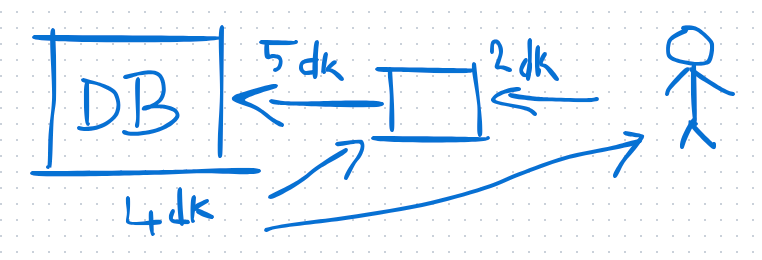

# Transaction Yönetimi ve Saga Deseni

## ACID ve Transaction Yönetimi
ACID (Atomicity, Consistency, Isolation, Durability), bir işlemin bütün olarak tamamlanıp tamamlanmadığını kontrol eden prensipler bütünüdür. Transaction yönetimi, işlemlerin güvenli ve tutarlı bir şekilde yürütülmesini sağlar.

### Atomik İşlemler
- **Atomic Integer & Atomic Values**: İşlemler atomik olarak ele alınır, yani bölünemez.
- **Synchronized**: Tek bir thread tarafından okunabilir ve diğer kod blokları bekletilir.
- **Deadlock**: İki thread'in birbirini beklemesi sonucu işlemin kilitlenmesi. Deadlock oluştuğunu anlamanın yolları:
  - CPU kullanımı düşükken, transaction sayısı artıyorsa deadlock ihtimali yüksektir.
  - Write işlemleri arttığında sistemin yanıt süresi uzuyorsa deadlock olabilir.

### Timeout Süreleri
- Servis ve işlem süreleri ile uyumlu timeout süreleri ayarlanmalıdır. Aksi halde hata alınır.
- Deadlocklar genellikle uzun süren transactionlar yüzünden oluşur.

### Rollback
- Rollback süresi uzarsa kilitlerin çözülmesi de gecikir ve sistem yavaşlar.

---

## Saga Deseni ve Long-Running Process Yönetimi
Saga, transaction modelini çözmek için kullanılan bir desendir. **Long-running process** gerektiren işlemleri yönetmek için kullanılır.

### İki Farklı Veritabanında İşlem (Two-Phase Commit)
- İki farklı veritabanında işlem yaparken **Two-Phase Commit (2PC)** kullanılabilir.
- Java'da bu işlem için **JTA (Java Transaction API)** kullanılabilir.
- Ancak, 2PC'nin karmaşıklığı nedeniyle hatalarla karşılaşıldığında **ters işlem** (compensation) yapılır.
- Silme işlemlerinde **soft delete** yerine **state machine** kullanımı daha güvenli olabilir.

---

#### BPM (Business Process Management)
- **BPMN (Business Process Model and Notation)** kullanılarak sistem analizleri oluşturulur.
- Ancak, BPM modellerinin teoride düzgün çalışması pratikte her zaman kolay değildir.

### Audit Log ve Housekeeping
- Transaction loglarının ayrı bir veritabanında tutulması maliyetlidir.
- Alternatif olarak **audit log** veya **housekeeping** yöntemleri kullanılabilir.
- **B-Tree** gibi veri yapıları kullanılabilir.

---

## Mikroservislerde Transaction Yönetimi
- Mikroservisler genellikle **REST API** üzerinden haberleşir.
- Ancak, servisler arası iletişimde **binary protokoller** veya **mesaj kuyrukları** kullanılabilir.
- **Transaction ID ve Saga ID** kullanımı, transactionların izlenmesini kolaylaştırır.

### Güvenlik ve DevOps
- **SecOps**: Güvenlik süreçlerinin operasyonlarla entegre edilmesi.
- **GitOps**: Tüm altyapı değişikliklerinin **Git üzerinden yönetilmesi**.
- **Etckeeper**: `/etc` dizini üzerindeki değişikliklerin Git ile takip edilmesini sağlar.

---

## Versiyonlama ve Git Yönetimi
### Sürümleme Yöntemleri
- **SemVer (Semantic Versioning)**: Sürüm numaralandırma standartları.
- **Gitflow ve Mainline**: Ana dalın her zaman derlenebilir ve güncel olması gerekir.

### Kod İnceleme ve Commit Yönetimi
- Merge sırasında çakışmalar yaşanmaması için **kod incelemesi** yapılmalıdır.
- Merge sırasında çakışan kodlar, geliştirici tarafından güncellenip çözülmelidir.
- **Cherry-pick** kullanımı:
  - Her commit tek bir değişiklik içermelidir.
  - Aksi halde cherry-pick başarısız olabilir.
- **Conventional Commit** standartları uygulanmalıdır.

### GitLab - Nexus - Jenkins Entegrasyonu
- **GitLab**: Kod yönetimi ve CI/CD süreçleri için kullanılır.
- **Nexus**: Artifact yönetimi için kullanılır.
- **Jenkins**: CI/CD süreçlerini otomatikleştirmek için kullanılır.

