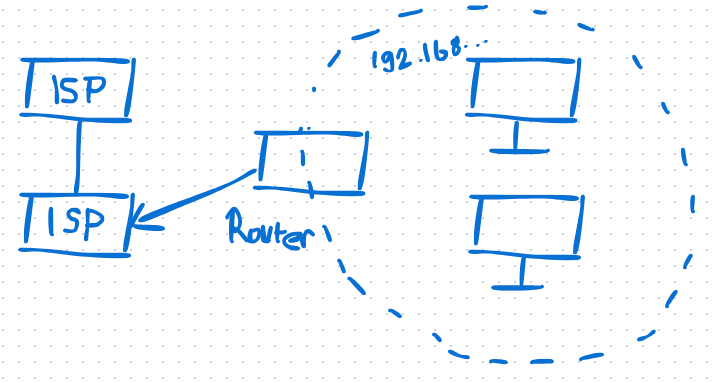
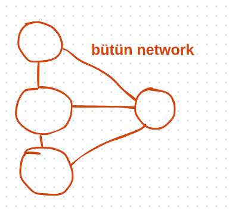
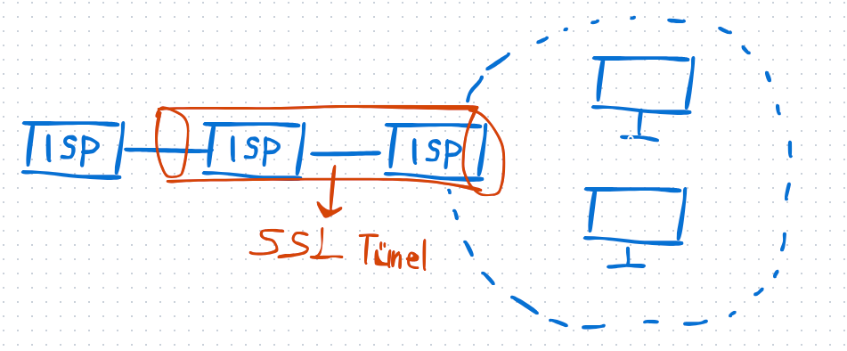
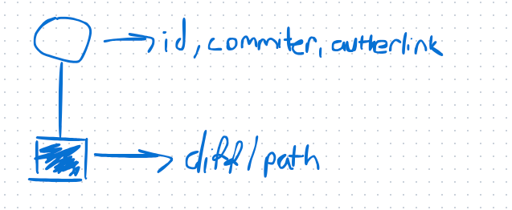

# SBOM (Software Bill of Materials) ve Güvenlik

## SBOM Nedir?
SBOM, bir yazılımın bağımlı olduğu tüm bileşenleri listeleyen bir envanterdir. Bir yazılımın hangi kütüphaneleri ve bağımlılıkları içerdiğini belirleyerek güvenlik açıklarını tespit etmeye yardımcı olur.  

- **Bağımlılık Yönetimi**: Bir paketin bağımlı olduğu diğer kütüphanelerin açıkları olabilir. Geliştiriciler, bu açıkları kapatmadan genellikle duyuru yapmaz.  
- **Penetration Testleri**: Yazılımların güvenliğini test etmek için yapılan saldırı simülasyonlarıdır.  

## SBOM ve Güvenlik Açıkları
Bağımlılıklar zaman içinde güncellenmezse, içerdiği güvenlik açıkları düzeltilmeyebilir. Bu nedenle SBOM araçları kullanılarak bağımlılıklar sürekli takip edilmelidir.  

- **Bağımlılık Analiz Araçları**  
  - **GitHub Dependabot**: Derleme sırasında bağımlılık güncellemeleri ve güvenlik açıklarını bildirir.  
  - **Fortify**: Sadece bağımlılıkları değil, yazılan koddaki güvenlik açıklarını da analiz eder ve nasıl düzeltileceğini önerir. Ancak ücretlidir.  
  - **SonarQube**: Kod kalitesini ve güvenlik açıklarını tespit eder ancak çözümleri doğrudan sunmaz.  

## Container Güvenliği
Containerlar, birer sanal makine gibi içinde bir Linux dağıtımı barındırır. Bu nedenle sadece uygulama kodunu değil, imajın içeriğini de güncel tutmak gerekir.  

- **Container Image Güvenliği**  
  - Hazır container imajları kullanılırken bağımlılıkları, açıkları ve gereksiz paketleri kontrol etmek gerekir.  
  - **NPM Paketleri**: NPM gibi kaynaklardan indirilen paketlerin içeriği denetlenmelidir. Aksi takdirde zararlı yazılımlar içerebilir ve sistem güvenliğini tehlikeye atabilir.  

## Hash ve İmza Kontrolleri
- **MD5, SHA1 gibi hash fonksiyonları**, dosyanın bütünlüğünü doğrulamak için kullanılır.  
- **Nexus** gibi araçlar, paket imzalarını kontrol ederek güvenlik doğrulaması yapar.  

## Sertifikalar ve Şifreleme
Sertifikalar, güvenli iletişimi sağlamak için kullanılır. Bir sertifikanın geçerli olup olmadığı, hash imzalarıyla doğrulanır.  

- **Public Key ve Private Key**  
  - **Public Key (Açık Anahtar)**: Herkesle paylaşılabilir.  
  - **Private Key (Özel Anahtar)**: Kesinlikle korunmalıdır. Çalınırsa sistem güvenliği tehlikeye girer.  
  - **Şifreleme Mantığı**:  
    - Özel anahtarla şifrelenen veri, yalnızca açık anahtarla açılabilir.  
    - Açık anahtarla şifrelenen veri, yalnızca özel anahtarla açılabilir.  

- **Çift Taraflı SSL, PGP ve GPG**  
  - SSL (Secure Sockets Layer), verinin şifrelenerek aktarılmasını sağlar.  
  - PGP (Pretty Good Privacy) ve GPG (GNU Privacy Guard), e-posta ve dosya güvenliği için kullanılır.  

## SSL ve Güvenlik  
SSL, internet üzerinden güvenli veri aktarımı sağlar.  
- **SSL Handshake**:  
  - İstemci ve sunucu karşılıklı olarak sertifikalarını paylaşır.  
  - Doğrulama sonrası güvenli bir tünel oluşturulur.  
  - Trafik şifrelenerek dinlemeye karşı korunur.  

## Güçlü Şifreleme Algoritmaları  
- **SHA-256, SHA-512** gibi algoritmalar, güçlü şifreleme sağlamak için kullanılır.  
- CPU gücü arttıkça daha güçlü hash algoritmaları tercih edilmelidir.  

## NOT
Kriptoladiginiz privi pub ile pubi da priv ile açabiliriz. Privkeyi CANIN GIBI KORUMALISIN. 
Public keyi de dağıtmak gerekir. GEREKIRSE TUM DUNYAYA.

Isp verilen id (saga vs) ile her şeyi dinliyor.

--------------------------------

Telnet internetteki temel protokollerin hepsi, human readeble.

## SSL ve Güvenli İletişim  

SSL, sertifikalar ile kullanılır ve iletişimi daha güvenli hale getirir. Bağlantı kurulurken istemci ve sunucu karşılıklı olarak sertifikalarını paylaşır ve doğrulama işlemi gerçekleşir. Sertifika doğrulandıktan sonra güvenli bir tünel açılır. Bu süreç **SSL Handshake** olarak adlandırılır.  

Bağlantı sırasında **hangi IP’nin hangi IP ile iletişim kurduğu izlenebilir**, ancak **iletişimin içeriği şifreli olduğu için okunamaz**. Veriler **public key (açık anahtar)** ile şifrelenir ve yalnızca **private key (özel anahtar)** ile çözülebilir. Bu sayede **uçtan uca şifreleme sağlanır** ve iletilen verilerin gizliliği korunur.

## Hash Fonksiyonları: SHA-5 ve SHA-6  

SHA-5 ve SHA-6, temelde aynı mantıkla çalışan hash fonksiyonlarıdır, ancak **bit uzunlukları farklıdır**. CPU gücü arttıkça daha güçlü hash fonksiyonlarına ihtiyaç duyulur, bu yüzden zamanla daha uzun bitli algoritmalara geçiş yapılmaktadır. Güvenlik açısından, **daha uzun bitli hash fonksiyonları daha güçlü kabul edilir**, çünkü kırılması daha zordur.  

## Yazılım Testleri  

### Birim Testleri ve API Testleri  
Her **API’nin bir testinin olması gereklidir**. Birim testleri, kodun küçük parçalarını test ederek **hataları erken aşamada tespit etmeye yardımcı olur**. Test yazarken kodun test edilebilir şekilde parçalara ayrılması önemlidir, aksi takdirde test yazmak zorlaşır.  

### Canlı Ortamda Testler  
Üretim (prod) ortamında **yalnızca yük testi yapılmalıdır**. Diğer testler, veritabanını bozabilir veya sistemin kararlılığını tehlikeye atabilir.  

### Konfigürasyon Farklılıkları  
Geliştirme (dev) ve üretim (prod) ortamlarının kaynakları genellikle eşit değildir. Bu durum, **konfigürasyon hatalarına** neden olabilir. Örneğin, **geliştirme ortamında çalışan bir yapı, prod ortamında yeterli kaynak olmadığı için başarısız olabilir**.  

## Deployment ve Helm  

Uygulamaların dağıtımı için **Helm tercih edilmelidir**. Helm, Kubernetes üzerinde **deployment işlemlerini daha yönetilebilir hale getirir**. Helm chart'lar sayesinde, **değişken tanımlamaları ve yapılandırmalar merkezi olarak yönetilebilir**.  

## Merge Commit  

**Merge commit'in iki yöntemi vardır**:  
1. **Fast-forward merge**: Eğer hedef branch’te yeni commit yoksa, mevcut değişiklikler doğrudan branch'e eklenir.  
2. **Merge commit (no fast-forward)**: Değişiklikleri birleştirmek için yeni bir merge commit oluşturulur. Bu yöntem, **commit geçmişini daha iyi takip etmek için tercih edilir**.  

## XKCD ve Yazılım Kültürü  

XKCD, yazılım ve bilgisayar bilimiyle ilgili popüler bir **meme (karikatür serisi)** kaynağıdır. Yazılım dünyasında **rastgele iş yapmak ve bir şeye isim vermek en zor şeyler arasındadır**. XKCD, genellikle bu tür zorlukları mizahi bir dille ele alır.  

## Git ve Commit Yönetimi  

- **Git'te commit'ler silinmez**, ancak son commit değiştirilebilir.  
- Yerel Git deposunda `git commit --amend` komutu ile **son commit'in içeriği ve mesajı değiştirilebilir**.  
- Daha fazla pratik yapmak için **[learngitbranching.js.org](https://learngitbranching.js.org/)** adresi kullanılabilir.  

## MIME Türleri  

- **MIME (Multipurpose Internet Mail Extensions) türleri**, dosya türlerini belirten bir standarttır.  
- `mimetype` ve `minetype` kelimeleri arasında bir fark yoktur, ancak **doğru kullanım "MIME type" olarak geçer**.  

## RFC (Request for Comments)  

- **RFC**, internet ve ağ protokollerinin standartlarını belirleyen dokümanlardır.  
- Örneğin, HTTP/1.1 protokolü **RFC 2616** tarafından tanımlanmıştır.  

## Knative ve Kubernetes  

- **Knative**, Kubernetes üzerinde çalışan serverless uygulamalar için geliştirilmiş bir platformdur.  
- Kubernetes’in temelinde **REST API'ler** bulunur ve tüm nesneler bu API'ler üzerinden yönetilir.  
- **Knative yalnızca Kubernetes ortamında çalışır**. Farklı bir platformda kullanılacaksa **Knative uygun olmayabilir**.  

## `kubectl` ve Kubernetes API  

- `kubectl`, Kubernetes API'lerini çağırarak **GET, POST, DELETE gibi işlemleri** yapar.  
- **Kubernetes, Go diliyle yazılmıştır** ve `kubectl` de Go ile geliştirilmiştir.  

## Kubernetes CRD ve Operatörler  

- **CRD (Custom Resource Definition)**, Kubernetes’e özel kaynak türleri eklemeye yarar.  
- **Job'ların denetleyicileri (controllers)** hangi düğümde (node) çalıştırılacaklarını belirler.  
- **Operatör (Operator) Pattern**, Kubernetes üzerinde **karmaşık uygulamaları yönetmek için geliştirilmiş bir yaklaşımdır**.  

## Helm ve Dağıtım (Deployment)  

- **Helm, Kubernetes yönetimini kolaylaştıran bir paket yöneticisidir**.  
- **Yapılandırmaları merkezi bir şekilde yönetmeyi sağlar**.  
- Helm tercih edilmesinin nedeni, **deployment süreçlerini standartlaştırması ve yönetimi kolaylaştırmasıdır**.  

## PKCS 11 ve PKCS 12  

- **PKCS#11**, donanım güvenlik modülleri (HSM) ve akıllı kartlarla çalışmak için kullanılır.  
- **PKCS#12**, **sertifika ve özel anahtarları şifreli bir şekilde saklamak için** kullanılır.  
- **İkisi benzer görünse de kullanım amaçları farklıdır**.  

## Yazılım Geliştirmede Zorluklar  

- Yazılım dünyasında **en zor şeylerden biri rastgele iş yapmak ve bir şeye isim vermektir**.  

## İzleme ve Güvenlik Araçları  

- **Housekeeping**: Sistemlerin düzenli olarak bakımının yapılması ve gereksiz verilerin temizlenmesi.  
- **Redmine**: Açık kaynaklı bir proje yönetim aracıdır.  
- **SonarQube**: Kod kalitesini analiz eden bir araçtır.  
- **Nexus**: Paket depolama ve bağımlılık yönetimi sağlayan bir sistemdir.  
- **SELinux (Security-Enhanced Linux)**: Linux sistemlerinde ek güvenlik politikaları uygulayan bir güvenlik modülüdür.  

